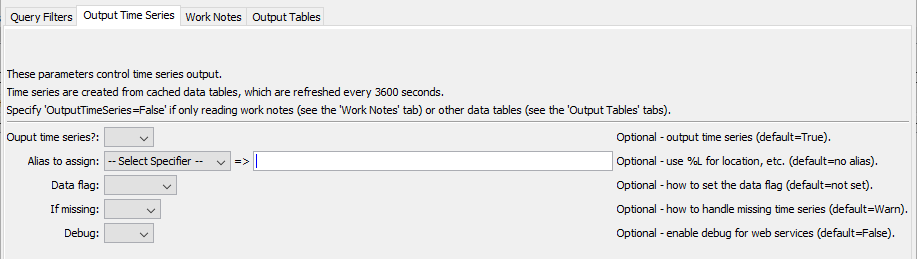
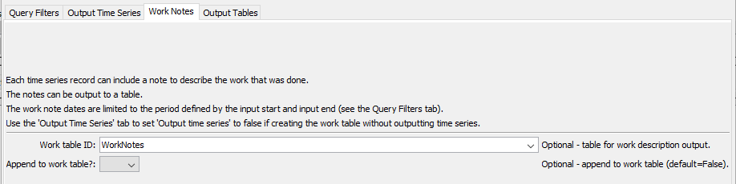

# TSTool / Command / ReadTimesheetsCom #

*   [Overview](#overview)
    +   [Time Series](#time-series)
    +   [Work Notes](#work-notes)
    +   [Other Data Tables](#other-data-tables)
*   [Command Editor](#command-editor)
    +   [Match Single Time Series](#match-single-time-series)
    +   [Match 1+ Time Series](#match-1-time-series)
*   [Command Syntax](#command-syntax)
*   [Examples](#examples)
    +   [Streamline Data Review](#streamline-data-review)
    +   [Identify New Data](#identify-new-data)
*   [Troubleshooting](#troubleshooting)
*   [See Also](#see-also)

-------------------------

## Overview ##

The `ReadTimesheetsCom` command reads time series, work notes, and other data tables using the Timesheets.com API.
See the [TimesheetsCom Data Web Services Appendix](../../datastore-ref/TimesheetsCom/TimesheetsCom.md)
for more information about `timesheets.com` web service integration and limitations.

### Time Series ###

The `ReadTimesheetsCom` command reads one or more time series from `timesheets.com` web services:

*   Read a single time series by matching a TSTool time series identifier (TSID).
*   Read 1+ time series using filters similar to the main TSTool window.

The command is designed to utilize web service query criteria to process large numbers of time series,
for example to produce real-time information products and perform historical data analysis and quality control.

See also the
[TSID for TimesheetsCom](../TSID/TSID.md) time series identifier command,
which reads time series for a single time series.

The ***Data type***, ***Data interval***, and ***Where*** command parameters and input fields
are similar to those in the main TSTool interface.
However, whereas the main TSTool interface first requires a query to find the
matching time series list and interactive select to copy specific time series identifiers into the ***Commands*** area,
the `ReadTimesheetsCom` command automates reading the time series list and the corresponding data for the time series.
Using the `ReadTimesheetsCom` command can greatly shorten command files and simplify command logic
when processing many time series.
However, because the command can process many time series and web services are impacted by network speed,
running the command can take a while to complete for large datasets.

Data for the location and other time series metadata,
as shown in the main TSTool interface, are set as time series properties, using web service data values.
Right-click on a time series in the TSTool ***Results*** area and then use the
***Time Series Properties*** menu to view time series properties.
These properties can be transferred to a table with the
[`CopyTimeSeriesPropertiesToTable`](https://opencdss.state.co.us/tstool/latest/doc-user/command-ref/CopyTimeSeriesPropertiesToTable/CopyTimeSeriesPropertiesToTable/)
command and processed further with other table commands.

All time series use `Day` interval, with values being the number of hours worked in a day for a project.

### Work Notes ###

Time series are created from timesheet records, with the time series values being project work hours.
It is also useful to see the work notes that are entered in timesheets.
The work notes are NOT saved in time series but can be output separately for the following cases:

1.  Read time series (`OutputTimeSeries=True`, which is the default case)
    and also output the work notes (specify the `WorkTableID` parameter):
    *   timesheet data are read using query parameters for the time series
    *   the time series **will** be listed in the TSTool ***Results / Time Series***
    *   the work notes table **will** be listed in the TSTool ***Results / Tables***
2.  Do Read time series (`OutputTimeSeries=False`) but output the work notes (specify the `WorkTableID` parameter):
    *   timesheet data are read using query parameters for the time series
    *   the time series **will not** be listed in the TSTool ***Results / Time Series***
    *   the work notes table **will** be listed in the TSTool ***Results / Tables***

The work notes table includes basic information.
Additional columns may be added in the future.
If necessary, use the [`DeleteTableRows`](https://opencdss.state.co.us/tstool/latest/doc-user/command-ref/DeleteTableRows/DeleteTableRows/)
command to remove unnecessary table columns.

### Other Data Tables ###

The command can also be used to read other data tables,
including account codes, customers, projects, project time data, and users.
These tables can then be used as input to workflows.
Use the `OutputTimeSeries` command parameter to control whether or not time series are also read while reading the data tables.

## Command Editor ##

The following dialog is used to edit the command and illustrates the syntax for the command.
The top and bottom of the editor provides general command parameters.

Two options are available for matching time series as described in the following sections.

### Match Single Time Series ###

The following example illustrates how to read a single time series by specifying the data type and interval (top)
and customer, project, and user name (***Match Single Time Series*** tab in the middle section).
This approach is similar to using the general
[`ReadTimeSeries`](https://opencdss.state.co.us/tstool/latest/doc-user/command-ref/ReadTimeSeries/ReadTimeSeries/)
command but offers parameters specific to `timesheets.com` web services.

**<p style="text-align: center;">

</p>**

**<p style="text-align: center;">
`ReadTimesheetsCom` Command Editor to Read a Single Time Series (<a href="../ReadTimesheetsCom-single.png">see full-size image)</a>
</p>**

The following editor tabs organize other command parameters.

**<p style="text-align: center;">

</p>**

**<p style="text-align: center;">
`ReadTimesheetsCom` Command Editor for Query Filter Parameters (<a href="../ReadTimesheetsCom-QueryFilters.png">see full-size image</a>)
</p>**

**<p style="text-align: center;">

</p>**

**<p style="text-align: center;">
`ReadTimesheetsCom` Command Editor for Output Time Series Parameters (<a href="../ReadTimesheetsCom-OutputTimeSeries.png">see full-size image</a>)
</p>**

**<p style="text-align: center;">

</p>**

**<p style="text-align: center;">
`ReadTimesheetsCom` Command Editor for Work Notes Parameters (<a href="../ReadTimesheetsCom-WorkNotes.png">see full-size image</a>)
</p>**

**<p style="text-align: center;">

</p>**

**<p style="text-align: center;">
`ReadTimesheetsCom` Command Editor for Output Tables Parameters (<a href="../ReadTimesheetsCom-OutputTables.png">see full-size image</a>)
</p>**

### Match 1+ Time Series ###

The following figure illustrates how to query multiple time series.
For example, this can be used to process all time series of a data type in the system
or all time series for a location.
Parameters shown at the top and bottom of the editor (as shown in the previous section) can also be used when reading multiple time series.

**<p style="text-align: center;">

</p>**

**<p style="text-align: center;">
`ReadTimesheetsCom` Command Editor to Read Multiple Time Series (<a href="../ReadTimesheetsCom-multiple.png">see full-size image)</a>
</p>**

## Command Syntax ##

The command syntax is as follows:

```text
ReadTimesheetsCom(Parameter="Value",...)
```

**<p style="text-align: center;">
Command Parameters
</p>**

|**Area/Tab**|**Parameter**&nbsp;&nbsp;&nbsp;&nbsp;&nbsp;&nbsp;&nbsp;&nbsp;&nbsp;&nbsp;&nbsp;&nbsp;&nbsp;&nbsp;&nbsp;&nbsp;&nbsp;&nbsp;&nbsp;&nbsp;&nbsp;&nbsp;|**Description**|**Default**&nbsp;&nbsp;&nbsp;&nbsp;&nbsp;&nbsp;&nbsp;&nbsp;&nbsp;&nbsp;&nbsp;&nbsp;&nbsp;&nbsp;&nbsp;&nbsp;&nbsp;&nbsp;&nbsp;&nbsp;&nbsp;&nbsp;&nbsp;&nbsp;&nbsp;&nbsp;&nbsp;|
|--------------|-----------------|-----------------|--|
|Top|`DataStore`<br>**required**|The TimesheetsCom datastore name to use for the web services connection, as per datastore configuration files (see the [TimesheetsCom Web Services Datastore appendix](../../datastore-ref/TimesheetsCom/TimesheetsCom.md)). | None - must be specified. |
||`DataType`<br>**required**|The data type to be queried. | Currently always `ProjectHours`. |
||`Interval`<br>**required**|The data interval for the time series. | Currently always `Day`. |
|***Match Single Time Series***|`CustomerName`<br>**required**|The customer name to match. | None - must be specified to read a single time series. |
| |`ProjectName`<br>**required**|The project name to match. | None - must be specified to read a single time series. |
| |`UserLastName`<br>**required**|The user last name to match. | None - must be specified to read a single time series. |
| |`UserFirstName`<br>**required**|The user first name to match. | None - must be specified to read a single time series. |
||`TSID`| A view-only value that indicates the time series identifier that will result from the input parameters when a single time series is queried. | |
|***Match 1+ Time Series***|`WhereN`|When reading 1+ time series, the “where” clauses to be applied.  The filters match the values in the Where fields in the command editor dialog and the TSTool main interface.  The parameters should be named `Where1`, `Where2`, etc.  A gap in numbering will result in the remaining items being ignored.  The format of each value is:<br>`Item;Operator;Value`<br>Where `Item` indicates a data field to be filtered on, `Operator` is the type of constraint, and `Value` is the value to be checked when querying.  Additional information for query filters is as follows:<ul><li>`ProjectStatus` - default is `Active`</li></ul>|If not specified, the query will not be limited and very large numbers of time series may be queried.|
|**Query Filter**|`InputStart`|Start of the period to query, specified as a date/time with a precision that matches the requested data interval.|Read all available data.|
||`InputEnd`|End of the period to query, specified as a date/time with a precision that matches the requested data interval.|Read all available data.|
||`IncludeHours`|Indicate which timesheet hours to include:<ul><li>`All` - read all data</li><li>`Archived` - only read archived data</li><li>`New` - only read new hours (not archived)</li></ul>|`All`|
|***Output Time Series***|`OutputTimeSeries`| Whether time series should be output: <ul><li>`False` - use when only the work notes table or other tables are being output</li><li>`True` - to the output time series</li></ul> | `True` |
||`Alias`|The alias to assign to the time series, as a literal string or using the special formatting characters listed by the command editor.  The alias is an identifier used by other commands to locate time series for processing, as an alternative to the time series identifier (`TSID`).  Because the time series identifier is relatively complex, it is often cleaner to use properties to define the alias, for example customer and user data set as processor or time series properties. |None – alias is not assigned.|
| | `DataFlag` | Indicate how to set the data flag for time series values:<ul><li>`Archived` - the data `archived` value (`1` = active, `0` = archived)</li><li>`Archived0` - like `Archived`, but only set the flag if the value is `0`</li><li>`Archived1` - like `Archived`, but only set the flag if the value is `1`</li></ul> | No flag is set. |
| | `IfMissing` | Currently not implemented. | |
| |`Debug`| Used for troubleshooting:  `False` or `True`. | `False` |
|***Work Notes***|`WorkTableID`| Table identifier for output table containing work notes corresponding to output time series. | |
| | `AppendWorkTable` | Whether to append to the work notes table: <ul><li>`False` - create the table</li><li>`True` - append work notes to the table (if it exists)</li></ul> | `False` |
|***Output Tables***|`AccountCodeTableID`| Table identifier for output table containing all account code data for the datastore. | |
| |`CustomerTableID`| Table identifier for output table containing all customer data for the datastore. | |
| |`ProjectTableID`| Table identifier for output table containing all project data for the datastore. | |
| |`ProjectTimeTableID`| Table identifier for output table containing all project time data for the datastore. | |
| |`UserTableID`| Table identifier for output table containing all user data for the datastore. | |

## Examples ##

See the [TimesheetsCom](../../datastore-ref/TimesheetsCom/TimesheetsCom.md) datastore documentation.

### Streamline Data Review ###

TSTool can be usd to streamline timesheet data review,
and then the `timesheets.com` website can be used to perform tasks.
For example:

1.  Use this command to read all time series:
    *   Specify a period to read as appropriate to review historical or recent data.
    *   Use the command parameters to filter data to active and/or archived projects,
        and new and/or archived data, etc.
2.  Use the ***Find Time Series...*** tool in ***Results*** to select time series of interest.
    For example, search for:
    *   `Unassigned` to find timesheet data that was not assigned to a customer or project.
    *   Specific project(s) of interest.
3.  Right-click in the TSTool ***Results*** and use the ***Graph - Point*** menu item to graph the data.
    This will display the timesheet data records and allow determining the dates for the data.
4.  Then use the `timesheets.com` website to perform tasks, such as archiving data or correcting timesheet records.
    Specify the period as needed to match the above graph.

Examples in the following sections illustrate the use of graphs to review data.

### Identify New Data ###

The `timesheets.com` website allows projects to be archived,
but only when the project's hours have been archived.
Hours that are not archived are considered to be "new hours".
The website by default only allows one year of data to be queried using the ***Reports*** tool
or processed using the ***Process Records*** tool.
If multiple years of project data exist,
it can be inefficient to determine the date where new hours exist because multiple periods must be requested.

TSTool simplifies this by allowing the full period to be viewed.
For example, the following graph was created by using `IncludeHours=New` and `DataFlag=Archived`,
displaying a point graph, and then labeling the graph with the data flag.
A point graph without the labels will also show the points without labels.
Then, use the ***Process Records*** tool to archive the data and then archive the project.

**<p style="text-align: center;">

</p>**

**<p style="text-align: center;">
Example Graph to Identify New Data (<a href="../example-new-data-graph.png">see full-size image)</a>
</p>**

## Troubleshooting ##

If listing time series or retrieving data has errors, try the following:

1.  Review the TSTool log file (see ***Tools / Diagnostics - View Log File*** for current and startup log file.)
2.  Confirm that the authorization information in the datastore configuration file is correct.
3.  Use command line `curl` to query the URL.

If the command pauses while running:

1.  It is likely due to the global data cache refreshing.
    This may take several minutes.
    The data cache refreshes if an hour has passed.

## See Also ##

*   [`CopyTimeSeriesPropertiesToTable`](https://opencdss.state.co.us/tstool/latest/doc-user/command-ref/CopyTimeSeriesPropertiesToTable/CopyTimeSeriesPropertiesToTable/) command
*   [`DeleteTableRows`](https://opencdss.state.co.us/tstool/latest/doc-user/command-ref/DeleteTableRows/DeleteTableRows/) command
*   [`ReadTimeSeries`](https://opencdss.state.co.us/tstool/latest/doc-user/command-ref/ReadTimeSeries/ReadTimeSeries/) command
*   [TSID for TimesheetsCom](../TSID/TSID.md) command
*   [`WebGet`](https://opencdss.state.co.us/tstool/latest/doc-user/command-ref/WebGet/WebGet/) command
