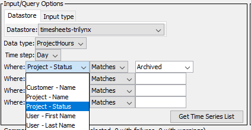

# TSTool / Datastore Reference / TimesheetsCom Web Services #

*   [Overview](#overview)
*   [Standard Time Series Properties](#standard-time-series-properties)
*   [Other Specifications and Integration Considerations](#other-specifications-and-integration-considerations)
*   [Limitations](#limitations)
*   [Datastore Configuration File](#datastore-configuration-file)
*   [See Also](#see-also)

--------------------

## Overview ##

The `timesheets.com` web services allow timesheets data to be queried by software,
including web applications and analysis tools such as TSTool.
TSTool accesses `timesheets.com` web services using the TimesheetsCom plugin.
See the following documentation:

*   [Install TimesheetsCom Plugin appendix](../../appendix-install/install.md)
*   [TimesheetsCom TSID command](../../command-ref/TSID/TSID.md)
*   [`ReadTimesheetsCom` command](../../command-ref/ReadTimesheetsCom/ReadTimesheetsCom.md)
*   [`timesheets.com` API documentation](https://secure05v.timesheets.com/api/public/v1/index.cfm?docs)
*   [`timesheets.com` Getting Started with the API](https://support2.timesheets.com/knowledge-base/getting-started/)

TSTool primarily uses the API `report/project/customizable` service to list time series and retrieve timesheet project data,
which are then processed into time series.
Other services are used to provide data for lookups.

The TSTool [`WebGet`](https://opencdss.state.co.us/tstool/latest/doc-user/command-ref/WebGet/WebGet/)
command can be used to retrieve data from any web service and save to a file.
For example, a CSV format file can be saved and the resulting file can be read using commands such as
[`ReadTableFromDelimitedFile`](https://opencdss.state.co.us/tstool/latest/doc-user/command-ref/ReadTableFromDelimitedFile/ReadTableFromDelimitedFile/)
(to read a table) and
[`ReadDelimitedFile`](https://opencdss.state.co.us/tstool/latest/doc-user/command-ref/ReadDelimitedFile/ReadDelimitedFile/)
(to read time series). The
[`ReadTableFromJSON`](https://opencdss.state.co.us/tstool/latest/doc-user/command-ref/ReadTableFromJSON/ReadTableFromJSON/)
command can be used to read a JSON file that has been retrieved from web services.
These general commands provide flexibility to retrieve data in addition to the specific TimesheetsCom datastore commands.

## Web Service to Time Series Mapping ##

Time series data objects in TSTool consist of various properties such as location identifier, data type, units,
and data arrays containing data values and flags.
To convert `timesheets.com` data to time series requires joining customer name, project name, and user last and first name
to create unique time series identifiers.
The project hours are then summed in the time series to provide a history of work activities by customer, project, and user (employee).
Only time series combinations with hourly data values greater than zero result in a time series that is shown in TSTool.

The TSTool main interface browsing tool displays joined information in the time series list to select time series.
The ***Data type*** and ***Time step*** are general filters implemented for all datastores and the
***Where*** input filters are specific to `timesheets.com` data.

**<p style="text-align: center;">

</p>**

**<p style="text-align: center;">
TSTool Where Filters
</p>**

## Standard Time Series Properties ##

The general form of time series identifier used by TSTool is:

```
LocationID.DataSource.DataType.Interval~DatastoreName
```

If the `LocationID` does not result in a unique time series identifier,
the `LocType` can be used to avoid ambiguity by indicating the type of the location, as shown below:

```
LocType:LocationID.DataSource.DataType.Interval~DatastoreName
```

The standard time series identifier format for `timesheets.com` web service time series is as follows,
where `TimesheetsCom` is used for the data source.
Single quotes are used around the `LocationId` to ensure that periods and other characters are properly handled.

```
'CustomerName/ProjectName/UserLastName,UserFirstName'.ProjectHours.Day~DatastoreName
```

The meaning of the TSID parts is as follows:

*   The `LocType` syntax is not currently used.
*   The `LocationId` is set to a concatenation of the following, using `/` between the first three main parts and comma between user name parts:
    +   `CustomerName`
    +   `ProjectName`
    +   `UserLastName`
    +   `UserFirstName`
*   The `DataSource` is set to `TimesheetsCom` and has no impact on reading data.
*   The `DataType` is set to:
    +   `ProjectHours` to indicate project hours.
    +   Support for hourly data will be added in the future.
*   The `Interval` is set to:
    +   `Day` always.
    +   Aggregation to week and month interval may be added in the future.
        Use other TSTool commands to process data as needed.
*   The `DatastoreName` is taken from the datastore configuration file `Name` property:
    +   The datastore name is listed in the TSTool main interface.
    +   Multiple datastores can be configured, each pointing to a different `timesheets.com` account.
        Therefore, datastore names should be assigned with enough detail to avoid confusion.
        The following are typical examples:
        -   `timesheets` - general datastore name but is ambiguous if more than one `timesheets.com` account is accessed at the same time
        -   `timesheets-org` - general datastore name indicating the account's organization

Important standard time series properties include:

1.  **Time Series Description**:
    1.  The project name is used for the time series description, which is used in graph legends.
2.  **Data Units**:
    1.  Data units of `Hours` are used for all data.
3.  **Missing Data Value**:
    1.  The special value `NaN` is used internally for the missing data value.
    2.  Applications can set missing values to zero if the interpretation is accurate.

See the next section for additional mapping of `timesheets.com` API data to TSTool time series.

## Other Specifications and Integration Considerations ##

The following are other specifications related to TSTool plugin integration with `timesheets.com` web services.

1.  **Service URL**:
    1.  The configuration file `ServiceRootURI` property includes the server root without service query parameters.
        See the [Datastore Configuration File](#datastore-configuration-file) section for an example.
2. **Data Caching:**
    1.  TSTool performance, in particular interactive features, is impacted by web service query times.
        Therefore, it is desirable to cache data in memory so that software does not need to requery web services.
        The API also has query limits and too many queries in a short time will result in HTTP 420 errors and API cutoff.
        To minimize issues, the plugin will retry queries after a dynamic wait period (increased until no 420 error)
        and this may result in a temporary delay and there is a maximum wait to prevent the software from hanging indefinitely.
        When data are cached, changes in the `timesheets.com` database will not be visible in the TSTool
        session unless TSTool rereads the data.
        There is a balance between performance and having access to the most recent data.
    2.  Currently, TSTool caches all data by reading the data at startup
        because the full list of time series can only be determined by examining all the data records.
        TSTool will also automatically refresh cached data when a request is made an hour or more after the
        previous request.
        If necessary, restart TSTool to read the current data.
    3.  Additional optimization of caching may be implemented in future releases.
3.  **Account and other codes:**
    1.  Currently the default is to read all timesheet records regardless of the account code,
        billable code, review status, etc.
    2.  The datastore configuration file and [`ReadTimesheetsCom`](../../command-ref/ReadTimesheetsCom/ReadTimesheetsCom.md)
        command may be enhanced in the future to provide more control.

## Limitations ##

The following limitations and design issues have been identified during development of the TimesheetsCom plugin.
Additional software development is required to overcome these limitations.

1.  **General:**
    1.  **Data Caching:**
        In order to determine a unique list of customers/projects/users,
        it is necessary to process all of the report data records.
        To ensure fast performance, the data are cached after reading.
        The API has access limits and caching the data helps avoid API cutoffs
        that might occur if many requests occurred in a short time,
        such as reading times series individually with corresponding web service requests.
        As a compromise, the report data are cached for an hour.
        Subsequent operations will cause the data to be reread, which will cause a slight delay.
        If it is necessary to retrieve current data, restart TSTool.
    2.  **Error handling:**
        1.  The `timesheets.com` web services return error messages and will be interpreted in more detail
            as experience with the API is gained.
        2.  If there is an error reading cached data at startup and after the expiration time, the
            [`ReadTimesheetsCom`](../../command-ref/ReadTimesheetsCom/ReadTimesheetsCom.md) command
            will show a warning.
2.  **Hourly data:**
    1.  Hourly data are not currently supported but are expected to be supported in a future release.

## Datastore Configuration File ##

A datastore is configured by creating a datastore configuration file.

Create a user datastore configuration file `.tstool/NN/datastores/timesheets-yourorg.cfg` (or similar) in the user's files,
for example by copying and modifying the following example, or copying from another installation.
The `NN` should agree with the major TSTool version, for example `14` as shown by the ***Help / About TSTool*** menu.
TSTool will attempt to open datastores for all enabled configuration files.

The following illustrates the TimesheetsComDataStore datastore configuration file format
and configures a datastore named `timesheets-abc`.
The `Name` property is the datastore name that will be used by the TSTool - the file name can be any name
but is often the same as the `Name` with extension `.cfg`.

```
# Configuration information for timesheets.com web service datastore.
# Properties are:
#
# Enabled - indicates if the datastore is enabled (active)
# ServiceApiDocumentationUri - URI for online API documentation
# Type - must be TimesheetsComDataStore to find proper software
#
# The user will see the following when interacting with the data store:
#
# Name - data store identifier used in applications, for example as the
#     input type information for time series identifiers (usually a short string)
# Description - data store description for reports and user interfaces (short phrase)
# ServiceRootURI - web service root URI, including the server name and root path

Enabled = True
#Enabled = False
Type = "TimesheetsComDataStore"
Name = "timesheets-abc"
Description = "ABC timesheets.com"
ServiceRootURI = "https://secure05v.timesheets.com/api/public/v1"
ServiceApiDocumentationUri = "https://support2.timesheets.com/knowledge-base/documentation/"
ApiKey = "INSERT KEY"
Authorization = "INSERT AUTHORIZATION"
# Known maximum daily limit (default is one year):
# - specify to increase the size of data read to increase performance
RequestDayLimit = 2500
```

**<p style="text-align: center;">
TimesheetsCom Web Services DataStore Configuration File
</p>**

The following table describes configuration file properties.
See the [`timesheets.com` Getting Started with the API](https://support2.timesheets.com/knowledge-base/getting-started/)
documentation for information about getting the API key and authentication tokens.

**<p style="text-align: center;">
TimesheetsCom Web Services DataStore Configuration File Properties
</p>**

| **Property**&nbsp;&nbsp;&nbsp;&nbsp;&nbsp;&nbsp;&nbsp;&nbsp;&nbsp;&nbsp;&nbsp;&nbsp;&nbsp;&nbsp;&nbsp;&nbsp;&nbsp;&nbsp;&nbsp;&nbsp;&nbsp;&nbsp;&nbsp;&nbsp;&nbsp;&nbsp;&nbsp;&nbsp;&nbsp;&nbsp;&nbsp;&nbsp;&nbsp;&nbsp;&nbsp;&nbsp;&nbsp;&nbsp;&nbsp;&nbsp; | **Description** | **Default** |
| -- | -- | -- |
| `ApiKey` | The API key for the user. |
| `Authorization` | The API authorization for the user. |
| `Description`<br>**required** | Description of the datastore, typically a short sentence, used in some displays. | None - must be specified. |
| `Enabled` | Indicates whether the datastore is enabled. | `True` |
| `Name`<br>**required** | Datastore name that is used in the TSTool software and TimesheetsCom plugin commands.  The name should be unique across all datastores. | None - must be specified. |
| `RequestDayLimit` | The `timesheets.com` account limit for the number of days that can be requested in an API call.  The default is typically one year but can be increased by contacting `timesheets.com`.  A larger limit allows more data to be requested and avoid HTTP 420 errors, which require spacing out calls and slowing down the software. Currently the value cannot be determined from the API. | The plugin assumes one year based on website warnings when a larger period is requested. |
| `ServiceApiDocumentationURI` | The URL for the web services API documentation, specific to the system.  This is used by software to display system-specific documentation. | Documentation will not be available from command editors. |
| `ServiceRootURI`<br>**required** | The root URL for the web services.  This should include everything except the service name and query parameters (the specific service name and query parameters are automatically specified by software to query data). | None - must be specified. |
| `Type`<br>**required** | Must be `TimesheetsComDataStore`, which is used by TSTool to identify which plugin software to use for the datastore. | None - must be specified. |

## See Also 

*   [TimesheetsCom TSID](../../command-ref/TSID/TSID.md) command
*   [`ReadDelimitedFile`](https://opencdss.state.co.us/tstool/latest/doc-user/command-ref/ReadDelimitedFile/ReadDelimitedFile/) command
*   [`ReadTimesheetsCom`](../../command-ref/ReadTimesheetsCom/ReadTimesheetsCom.md) command
*   [`ReadTableFromDelimitedFile`](https://opencdss.state.co.us/tstool/latest/doc-user/command-ref/ReadTableFromDelimitedFile/ReadTableFromDelimitedFile/) command
*   [`ReadTableFromJSON`](https://opencdss.state.co.us/tstool/latest/doc-user/command-ref/ReadTableFromJSON/ReadTableFromJSON/) command
*   [`WebGet`](https://opencdss.state.co.us/tstool/latest/doc-user/command-ref/WebGet/WebGet/) command
