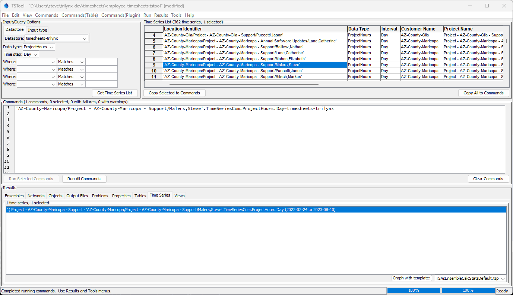

# TSTool / Getting Started #

This chapter provides an overview of getting started with TSTool and the TimesheetsCom plugin commands.

*   [Introduction](#introduction)
*   [Installing and Configuring TSTool](#installing-and-configuring-tstool)
*   [Starting TSTool](#starting-tstool)
*   [Installing the TimesheetsCom Plugin](#installing-the-timesheetscom-plugin)
*   [Listing `timesheets.com` Time Series](#listing-timesheetscom-time-series)
*   [Using the TimesheetsCom Plugin Commands](#using-the-timesheetscom-plugin-commands)

----------------

## Introduction ##

The TSTool user interface (UI) provides features to browse data, create command file workflows to process data,
and view time series and other information products.
The TSTool UI design follows several basic concepts and interactions.

*   See the [TSTool Documentation Getting Started](https://opencdss.state.co.us/tstool/latest/doc-user/getting-started/getting-started/)
    documentation for core product information.

The remainder of this documentation focuses on getting started with TSTool using the TimesheetsCom plugin.

## Installing and Configuring TSTool ##

If not already done, [install TSTool](https://opencdss.state.co.us/tstool/latest/doc-user/appendix-install/install/).
TSTool is most often installed on Windows but also runs on Linux.
Contact the Open Water Foundation if a Linux version is required.

## Starting TSTool ##

TSTool can be run in interactive mode and batch (command line) mode.
Interactive mode is typically used to prototype and configure automated workflows and products.
Batch mode can be used to run the software in headless mode on a server,
for example on a schedule or in response to web requests.

When using the State of Colorado’s TSTool default configuration on Windows,
the software can be started using ***Start / Programs / CDSS / TSTool-Version***.
The menus vary slightly depending on the operating system version.

Use the `tstool` script to start the software on Linux.
The program can be found in the software's `/bin` folder.
Multiple versions of TSTool can be installed to facilitate transition from older to newer versions.

To process a command file in batch mode without showing the user interface,
use a command line similar to the following:

```
tstool -–commands commands.tstool
```

It is customary to name command files with a `.tstool` file extension.
It may be necessary to specify a full (absolute) path to the command file when
running in batch mode in order for TSTool to fully understand the working directory.

See the [Running TSTool in Various Modes appendix](https://opencdss.state.co.us/tstool/latest/doc-user/appendix-running/running/)
for more information about running in batch and other modes.

## Installing the TimesheetsCom Plugin ##

See the [Appendix - Install Plugin](../appendix-install/install.md) documentation for instructions to install the plugin.

## Listing `timesheets.com` Time Series ##

The main TSTool user interface can be used to list `timesheets.com` time series, as follows:

1.  Select a TimesheetsCom datastore from the ***Datastore*** choices.
2.  Select a data type using the ***Data type*** choices, or select `*` to list all data types.
3.  Select a time step (interval) using the ***Time step*** choices, or select `*` to list all timesteps.
4.  Use the ***Where*** choices to specify time series filters,
    for example to list time series for a specific site or station.
5.  Press the ***Get Time Series List*** button to list time series.

The time series can then be copied to the ***Commands*** area as time series identifier (TSID) commands.

**<p style="text-align: center;">

</p>**

**<p style="text-align: center;">
TimesheetsCom Time Series List (<a href="../time-series-list.png">see full-size image)</a>
</p>**

## Using the TimesheetsCom Plugin Commands ##

TSTool TimesheetsCom plugin commands are provided to read time series from `timesheets.com`.
Additional commands may be added in the future as needed.
The primary uses of the plugin commands are:

*   read time series from `timesheets.com` web services to allow processing by other TSTool commands
*   automate visualizing TimesheetsCom time series
*   combine time series from TimesheetsCom and other sources

The following is a summary of plugin commands,
which are listed in the ***Commmands(Plugin)*** menu.

**<p style="text-align: center;">
TimesheetsCom Plugin Commands
</p>**

| **Command** | **Description** |
| -- | -- |
| [`ReadTimesheetsCom`](../command-ref/ReadTimesheetsCom/ReadTimesheetsCom.md) | Read one or more time series from the `timesheets.com` web services. |

See also the [`TSID`](../command-ref/TSID/TSID.md) command format for TimesheetsCom time series.
